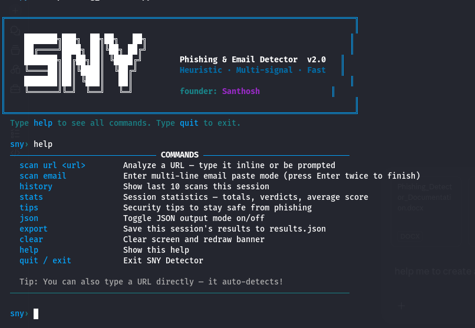
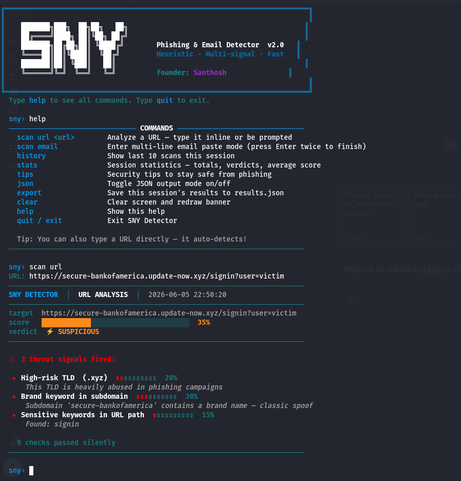
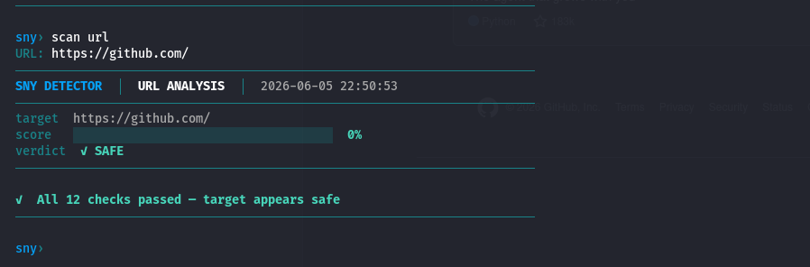
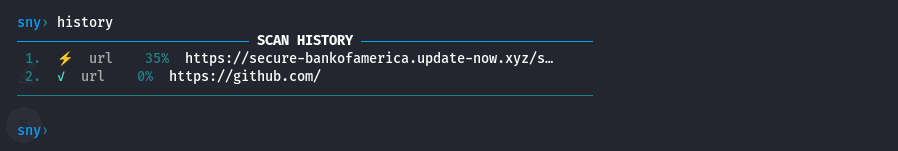
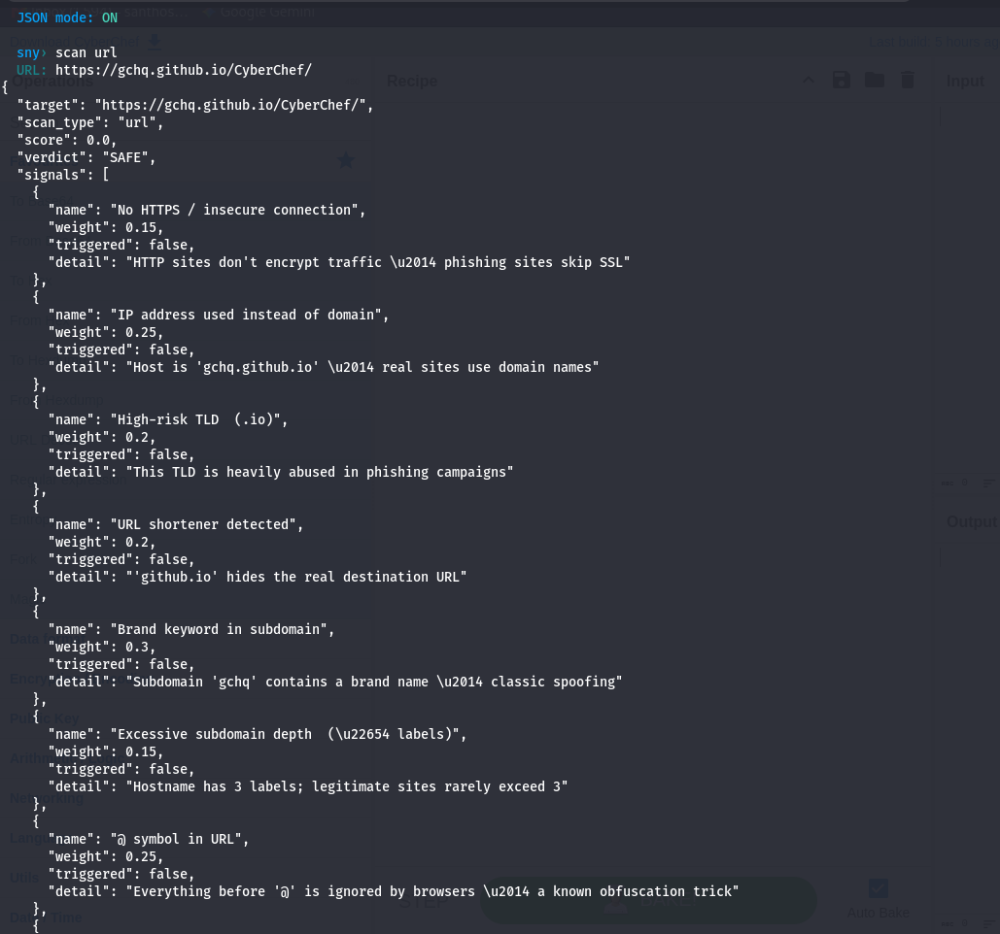

<div align="center">
  
</div>

<div align="center">

# 🛡️ SNY Phishing & Email Detector v2.0

**Heuristic · Multi-signal · Fast**

A terminal-based phishing detection engine for URLs and emails — built for speed, accuracy, and clarity.

*Founder: **Santhosh***

[](https://python.org)
[](LICENSE)
[]()
[]()
[]()

</div>

---

## 📸 Screenshots

<div align="center">

### 🖥️ Banner & Help Menu


---

### ⚡ URL Scan — Suspicious Result


---

### ✅ URL Scan — Safe Result


---

### 🗂️ Scan History


---

### 📤 JSON Output Mode


</div>

---

## 🔎 What Is SNY Detector?

**SNY Phishing & Email Detector** is a lightweight, zero-dependency command-line tool that analyzes URLs and emails for phishing indicators in real time. It uses a **multi-signal heuristic engine** — combining 12+ checks including TLD risk scoring, typosquatting detection, subdomain spoofing analysis, entropy scoring, and email header forensics — to give you an instant **SAFE / SUSPICIOUS / PHISHING** verdict with a confidence score.

Built entirely in Python's standard library, it runs anywhere Python runs — no pip installs, no API keys, no internet connection required.

---

## ✨ Features

| Feature | Description |
|---|---|
| 🔗 **URL Analysis** | 12 heuristic checks — TLD risk, typosquatting, subdomain spoofing, entropy |
| 📧 **Email Analysis** | Phishing phrases, display-name spoofing, reply-to mismatches, missing auth headers |
| ⚡ **Verdict Engine** | Instant `SAFE` / `SUSPICIOUS` / `PHISHING` with confidence score |
| 📊 **Session Stats** | Totals, verdicts, and average risk score for the session |
| 🗂️ **Scan History** | Last 10 scans with scores and verdicts |
| 📤 **JSON Export** | Toggle JSON mode or export full results to file |
| 💡 **Security Tips** | Built-in phishing awareness guide |
| 🎨 **Rich Terminal UI** | Color-coded output, progress bars, ASCII banner |

---

## 🚀 Quick Start

### Requirements

- Python 3.10 or higher
- No external dependencies — pure Python standard library

### Installation

```bash
git clone https://github.com/santhoshns2006-ui/sny-phishing-detector.git
cd sny-phishing-detector
python phishing_detector.py
```

That's it. No `pip install`. No setup. Just run.

---

## 🖥️ Commands

| Command | Description |
|---|---|
| `scan url <url>` | Analyze a URL — type inline or be prompted |
| `scan email` | Paste raw email for analysis (Enter twice to finish) |
| `history` | Show last 10 scans this session |
| `stats` | Session statistics — totals, verdicts, average score |
| `tips` | Security tips to stay safe from phishing |
| `json` | Toggle JSON output mode on/off |
| `export` | Save this session's results to `sny_results_<timestamp>.json` |
| `clear` | Clear screen and redraw banner |
| `help` | Show all commands |
| `quit` / `exit` | Exit SNY Detector |

> 💡 **Tip:** You can also type a URL directly — it auto-detects!

---

## 🔍 How It Works

### URL Signal Engine (12 Checks)

| # | Signal | Weight | Why It Matters |
|---|---|---|---|
| 1 | No HTTPS | 15% | Phishing sites often skip SSL encryption |
| 2 | IP address as host | 25% | Legitimate sites use domain names, not raw IPs |
| 3 | High-risk TLD | 20% | `.xyz`, `.tk`, `.ml`, `.top` are heavily abused |
| 4 | URL shortener | 20% | Hides the real destination URL |
| 5 | Brand keyword in subdomain | 30% | `secure-paypal.evil.com` — classic spoofing |
| 6 | Excessive subdomain depth | 15% | Hostnames with ≥4 labels are suspicious |
| 7 | `@` symbol in URL | 25% | Browsers ignore everything before `@` |
| 8 | Sensitive path keywords | 15% | `login`, `signin`, `verify`, `update`, `secure` |
| 9 | Long URL (>75 chars) | 10% | Used to hide malicious components |
| 10 | Typosquatting pattern | 35% | `paypa1.com`, `g00gle.com`, `arnazon.com` |
| 11 | IDN / Punycode domain | 30% | Visual homograph attacks using unicode chars |
| 12 | High domain entropy | 15% | Auto-generated domains like `xkqzptl.com` |

### Verdict Thresholds

| Score | Verdict | Meaning |
|---|---|---|
| ≥ 55% | 🔴 **PHISHING** | High confidence — do not visit |
| 25–54% | ⚡ **SUSPICIOUS** | Multiple signals fired — proceed with caution |
| < 25% | ✅ **SAFE** | All checks passed — appears legitimate |

### Email Analysis Checks

- **Display name spoofing** — "PayPal Support" sending from `random@gmail.com`
- **Reply-to mismatch** — Reply goes to a different address than the sender
- **Missing auth headers** — No SPF / DKIM / DMARC results
- **Urgency language** — "Your account will be suspended in 24 hours"
- **Credential harvesting phrases** — "Verify your password", "Confirm your details"
- **Suspicious links in body** — URLs that don't match the displayed text

---

## 📊 Example Output

```
SNY DETECTOR  |  URL ANALYSIS  |  2026-06-05 22:50:20

target  https://secure-bankofamerica.update-now.xyz/signin?user=victim
score   ████████░░░░░░░░░░░░  35%
verdict ⚡ SUSPICIOUS

▲ 3 threat signals fired:
  ► High-risk TLD  (.xyz)            ██░░░░░░░░  20%
      This TLD is heavily abused in phishing campaigns
  ► Brand keyword in subdomain       ███░░░░░░░  30%
      Subdomain 'secure-bankofamerica' contains a brand name — classic spoof
  ► Sensitive keywords in URL path   █░░░░░░░░░  15%
      Found: signin

  9 checks passed silently
```

---

## 📁 Project Structure

```
sny-phishing-detector/
├── phishing_detector.py              # Main detector engine
├── README.md                         # This file
├── LICENSE                           # MIT License
└── docs/
    ├── screenshots/                  # Preview images
    │   ├── banner.png
    │   ├── suspicious.png
    │   ├── safe.png
    │   ├── history.png
    │   └── json.png
    └── Phishing_Detector_Documentation.docx
```

---

## 🛡️ Security Tips

1. **Check the domain carefully** — Real PayPal is `paypal.com`, not `paypal-secure.update-now.tk`
2. **Always look for HTTPS** — The padlock icon + `https://` means your connection is encrypted
3. **Inspect email sender address** — Display names lie; always verify the actual `@domain`
4. **Watch for urgency** — Fake emails pressure you with "Act within 24 hours or lose access"
5. **Never click credential links from email** — Go directly to the website by typing it yourself
6. **Check reply-to address** — If it differs from the sender, it's suspicious
7. **Use 2FA everywhere** — Even if credentials are stolen, 2FA blocks the attacker
8. **Report phishing** — Gmail → Report Phishing | Outlook → Junk → Phishing Scam

---

## 📜 License

```
MIT License

Copyright (c) 2026 Santhosh (santhoshns2006-ui)

Permission is hereby granted, free of charge, to any person obtaining a copy
of this software and associated documentation files (the "Software"), to deal
in the Software without restriction, including without limitation the rights
to use, copy, modify, merge, publish, distribute, sublicense, and/or sell
copies of the Software, and to permit persons to whom the Software is
furnished to do so, subject to the following conditions:

The above copyright notice and this permission notice shall be included in all
copies or substantial portions of the Software.

THE SOFTWARE IS PROVIDED "AS IS", WITHOUT WARRANTY OF ANY KIND, EXPRESS OR
IMPLIED, INCLUDING BUT NOT LIMITED TO THE WARRANTIES OF MERCHANTABILITY,
FITNESS FOR A PARTICULAR PURPOSE AND NONINFRINGEMENT. IN NO EVENT SHALL THE
AUTHORS OR COPYRIGHT HOLDERS BE LIABLE FOR ANY CLAIM, DAMAGES OR OTHER
LIABILITY, WHETHER IN AN ACTION OF CONTRACT, TORT OR OTHERWISE, ARISING FROM,
OUT OF OR IN CONNECTION WITH THE SOFTWARE OR THE USE OR OTHER DEALINGS IN THE
SOFTWARE.
```

---

## 🤝 Contributing

Contributions, issues, and feature requests are welcome!

1. Fork the repo
2. Create your feature branch: `git checkout -b feature/new-signal`
3. Commit your changes: `git commit -m 'Add new phishing signal'`
4. Push to the branch: `git push origin feature/new-signal`
5. Open a Pull Request

---

<div align="center">

**Made with ❤️ by [Santhosh](https://github.com/santhoshns2006-ui)**

SNY Detector v2.0 · Heuristic · Multi-signal · Fast

⭐ Star this repo if it helped you stay safe from phishing!

</div>
